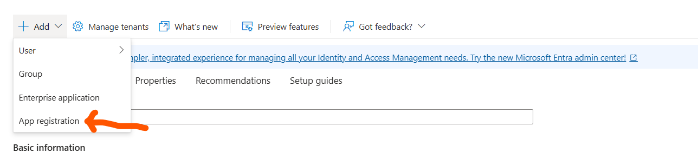
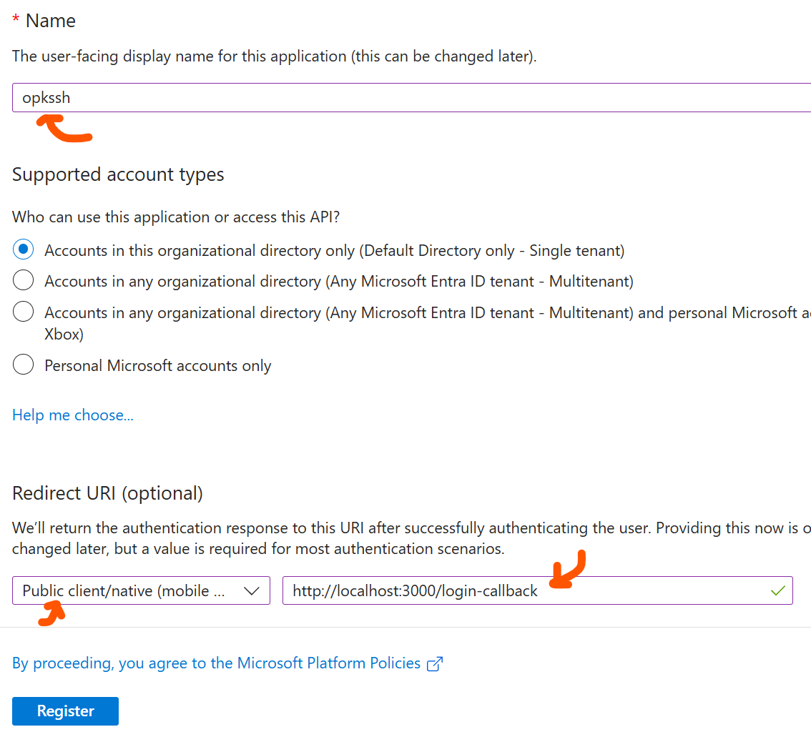
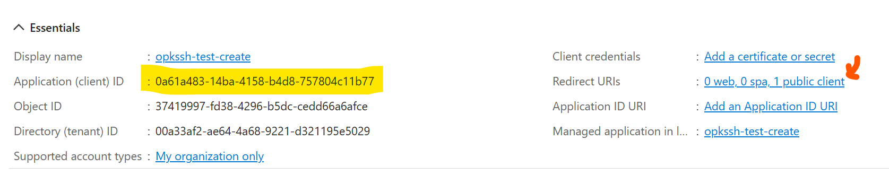
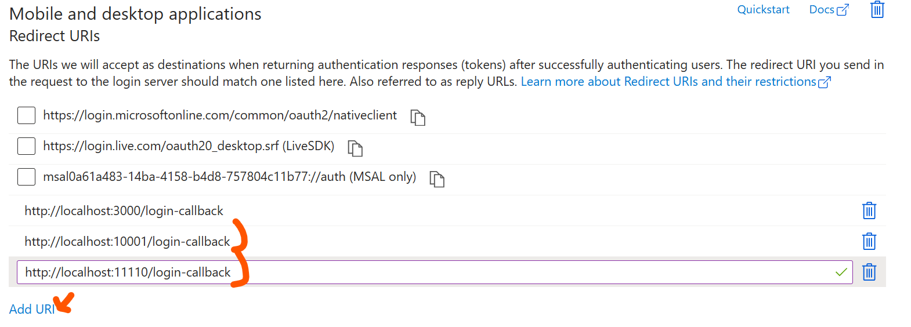
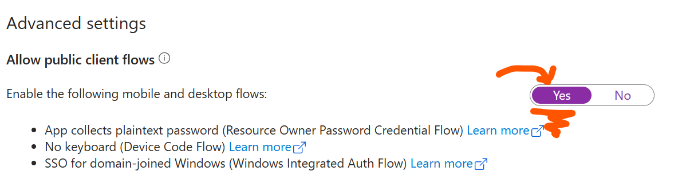
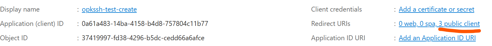
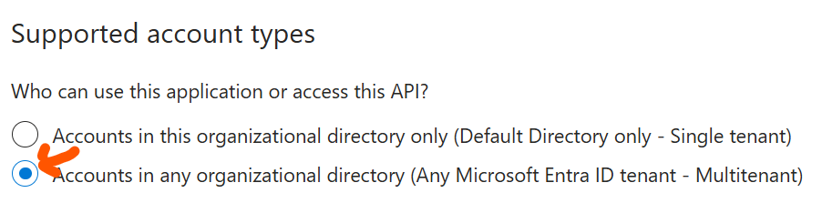

# Configuring Azure (Entra ID) for OPKSSH

Setting up Azure with OPKSSH is simple and should not take more than 10 minutes.
However Azure is very poorly organized and this leads to wasted time and misconfigurations.
To make this process as straightforward as possible we provide this guide.

**Note:** If you just want to use Azure with OPKSSH for personal email accounts, you can use default Azure client ID that comes with OPKSSH.

**Something not working?** Open a new issue on <https://github.com/openpubkey/opkssh>

## Setup

We are going to register a new app in Entra ID in Azure and then configure it to use our three redirect URIs:

```
http://localhost:3000/login-callback
http://localhost:10001/login-callback
http://localhost:11110/login-callback
```

### 1. Register an App for OPKSSH in Azure

Sign into <https://portal.azure.com/>, enter "Entra ID" into the search bar, and then click the entry for Entra ID.

On the Entra ID Page, click Add and then select "App Registration"



This should take you to the app registration page.
On this page enter openpubkey for your app name.
Then configure a redirect URI.

While OPKSSH has three redirect URIs Azure only lets you add one here.
You will add the other two later.
Add the redirect URI `http://localhost:3000/login-callback`.
Make sure to select public client for the redirect URI.
Then click "Register".



This should take you to a page that looks like this.



Make a note of the client ID and tenant ID (directory ID) you will need both of these later.

To add the other two redirect URIs click the link next to Redirect URIs with the text "0 web, 0 spa, 1 public client".



Now click "Add URI" add the two remaining redirect URIs: `http://localhost:10001/login-callback` and `http://localhost:11110/login-callback`. You should now have three redirect URIs.

Make sure not to include a `/` at the end of the URI.
This may break the configuration.

Do not navigate away!
Scroll down on this page until you get to "Advanced Settings."
Then click yes for "Allow Public Client Flow".
**Important** This must be set to Yes for OPKSSH to work.



Then click "Save".
After the changes save successfully, click "Overview" on the bar on the left.
It should look like it does here with Redirect URIs showing "3 public client".




### 2. Update client ID on client and service OPKSSH configs

For each server you have installed opkssh on, edit the file `/etc/opk/providers` and set the Azure provider to use the client ID and tenant ID you just registered.

```
https://login.microsoftonline.com/{TENANT ID}/v2.0 {CLIENT ID} 12h
```

To test run `opkssh login --provider="https://login.microsoftonline.com/{TENANT ID}/v2.0,{CLIENT ID}"` with the client ID you registered.
If this works then server has been setup correctly.

On the client check to see if you have already created a config at `~/.opk/config.yml`. If no config if found, create a config by running `opkssh login --create-config`.

Then edit `~/.opk/config.yml` and change the entry for azure to use the client ID and tenant ID from the App Registration.

```yaml
  - alias: azure microsoft
    issuer: https://login.microsoftonline.com/{TENANT ID}/v2.0
    client_id: {CLIENT ID}
    scopes: openid profile email offline_access
    access_type: offline
    prompt: consent
    redirect_uris:
      - http://localhost:3000/login-callback
      - http://localhost:10001/login-callback
      - http://localhost:11110/login-callback
```

For more information see: [opkssh configuration files](https://github.com/openpubkey/opkssh/blob/main/docs/config.md).

### 3. Test

Then run `opkssh login` or `opkssh login azure` on the client.
This should run without error.

## Troubleshooting (Common Issues)

### Error message: The request body must contain the following parameter: 'client_assertion' or 'client_secret'

```
Invalid_client" "AADSTS7000218: The request body must contain the following parameter: 'client_assertion' or 'client_secret'. Trace ID: afcdeabb-bf79-xxxx-xxxx-xxxxxxxx Correlation ID: d350f47c-a16d-xxxx-xxxx-xxxxxxx Timestamp: 2025-04-03 16:55:43Z" "https://login.microsoftonline.com/error?code=7000218"
```

This occurs if you have not configured your Azure App to allow public client. Make sure the button "Allow public client flows" is set to Yes.

### Error message: Not Enabled for Consumers

```
unauthorized_client: The client does not exist or is not enabled for consumers. If you are the application developer, configure a new application through the App Registrations in the Azure Portal at https://go.microsoft.com/fwlink/?linkid=2083908.
```

This message can mean one of three things: wrong tenant ID in client config, wrong client ID in client config or you attempted to log in with a consumer email account, e.g. a hotmail account.

If you want to use consumer accounts with Azure you need to select the option "Accounts in any organizational directory (Any Microsoft Entra ID tenant - Multitenant)" in Entra ID.



### OPKSSH not seeing Azure groups

By default Azure/Entra ID does not include the group's claim in ID Token.
To add it follow the instructions here: [Configure group claims for applications by using Microsoft Entra ID](https://learn.microsoft.com/en-us/entra/identity/hybrid/connect/how-to-connect-fed-group-claims)

### Error message: The endpoint only accepts POST requests. Received a GET request

```
Message: AADSTS900561: The endpoint only accepts POST requests. Received a GET request.
```

On the client check to see if you have already created a config at `~/.opk/config.yml`. If no config is found, create a config by running `opkssh login --create-config`.

Edit `~/.opk/config.yml` and for the azure provider change `prompt: consent` to `prompt: none` as shown below.

```yaml
  - alias: azure microsoft
    issuer: https://login.microsoftonline.com/{TENANT ID}/v2.0
    client_id: {CLIENT ID}
    scopes: openid profile email offline_access
    access_type: offline
    prompt: none
    redirect_uris:
      - http://localhost:3000/login-callback
      - http://localhost:10001/login-callback
      - http://localhost:11110/login-callback
``

See Issue: [Workaround for error message when using EntraID](https://github.com/openpubkey/opkssh/issues/253).
