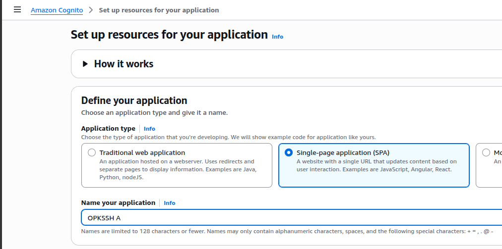
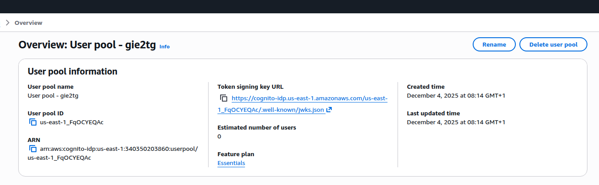
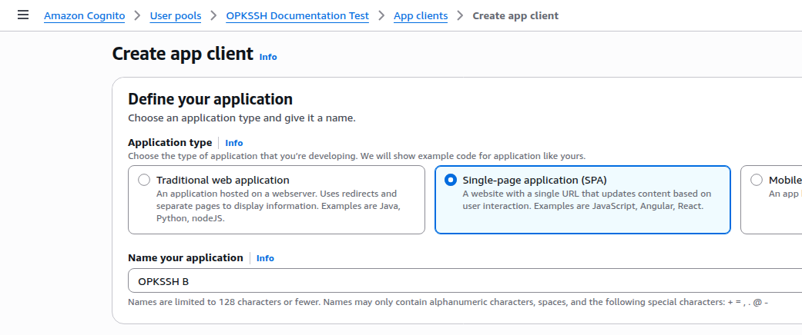
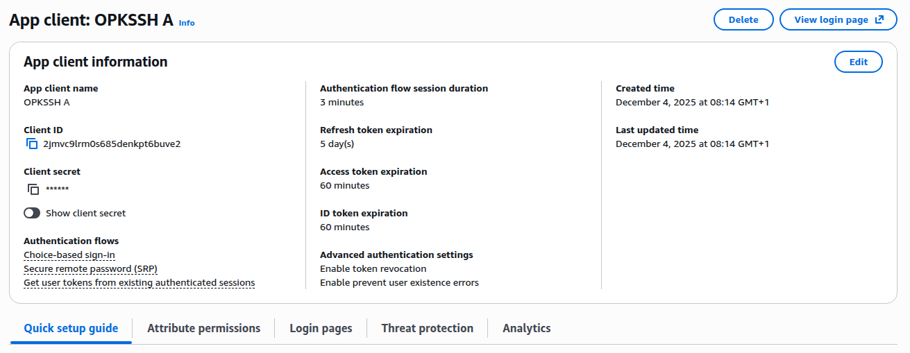
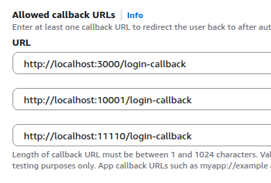
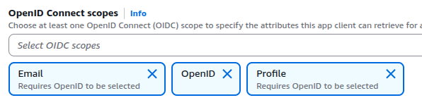
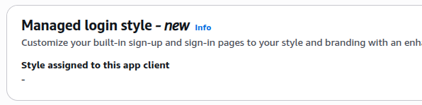
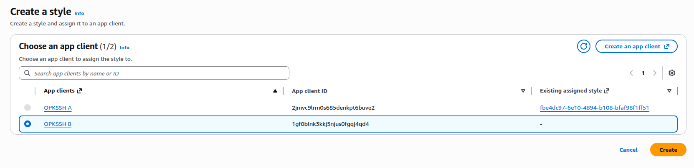

# Configuring Amazon Cognito for OPKSSH

Setting up Amazon Cognito with OPKSSH is simple and should not take more than 10 minutes.
To make this process as straightforward as possible we provide this guide.

**Something not working?** Open a new issue on <https://github.com/openpubkey/opkssh>

This guide is divided into two sections depending on if you have an existing Cognito User Pool or not.

- [**Setup without existing User Pool**](#setup-without-existing-user-pool)
- [**Setup with existing User Pool**](#setup-with-existing-user-pool)

Afterwards both sections converge at [**Modifying the App**](#modifying-the-app) where you will modify the app to add redirect URIs required by OPKSSH.

## Setup without existing User Pool

### 1. Create the User Pool

If you do not have an existing Cognito User Pool you can create one quickly by following these steps:

Start by going to [Amazon Cognito](https://us-east-1.console.aws.amazon.com/cognito/v2/idp/user-pools) and click `"Create user pool"`.

The name you specify will be the name of the Application, **not** the User Pool. Use a name like `"OPKSSH"`.

> [!WARNING]
>
> Make sure you select `"Single Page Application (SPA)"`, otherwise AWS will create a Client Secret.

> [!TIP]
>
> Check you are in the correct AWS region.



Decide options for sign-in identifiers and required attributes for signup, as they can never be changed later. We will setup return_uri's later.

Once ready click `"Create user directory"`.

### 2. Navigate to the App

Once the User Pool is created you will be taken to a Success page. Go to the bottom and click `"Go to overview"`. At this point you should see something like this:



> [!TIP]
>
> At this point you should rename your User Pool to something more meaningful like `"Datacenter Team"`.

Jump to the section [**Modifying the App**](#modifying-the-app) to continue the setup.

## Setup with existing User Pool

If you already have an existing User Pool, navigate to `"App clients"` section and click `"Create app client"`.

Enter a name of the application, like `"OPKSSH"`. **Remember to select `"Single Page Application (SPA)"`**.



We will setup return_uri's later. Once ready click `"Create app client"`.

> [!WARNING]
>
> Make sure you select `"Single Page Application (SPA)"`, otherwise AWS will create a Client Secret.

## Modifying the App

Inside your User Pool, click on `"App clients"` in the left-hand menu.

You should see the App you created earlier. Click on the App name.



### 1. Edit Login Info

In the navigation bar in the middle of the screen, click `"Login pages"` and then `"Edit"`.

Under `"Allowed callback URLs"` section, click the `"Add another URL"` button twice, and then make sure all 3 of the following URLs are present:

```
http://localhost:3000/login-callback
http://localhost:10001/login-callback
http://localhost:11110/login-callback
```



You also **MUST** edit the `"OpenID Connect Scopes"` section by removing **Phone** and adding **Profile**:

**OLD:**


**NEW:**



Click `"Save Changes"`.

### 2. Add a Managed Login page

If you go to the App > `"Login pages"` > `"Managed login style"` section, you can see if the App has a managed login page or not.



If you only see a `"-"` under `"Managed login style"`, you need to create one. Go to `"Managed login"` on the left-hand sidebar, under `"Styles"` click `"Create a new style"`. Select your app and click `"Create"`.



Your app should now be ready.

### Configure OPKSSH

For each server you have installed opkssh on, edit the file `/etc/opk/providers` and set the Cognito provider to the client ID and tenant ID you just registered.

> [!WARNING]
>
> **ATTENTION!** Do **NOT** specify your managed login domain if you have a custom domain. You must specify the IDP endpoint which is of the form:

```
https://cognito-idp.<aws-region>.amazonaws.com/<user-pool-id> <CLIENT-ID> 12h
```

To test run `opkssh login --provider="https://cognito-idp.us-east-1.amazonaws.com/us-east-1_xxxxxxxxx,<CLIENT-ID>"` with the User Pool ID and Client ID you registered. If this works then the App has been setup correctly.

On the client check to see if you have already created a config at `~/.opk/config.yml`. If no config if found, create a config by running `opkssh login --create-config`.

Then edit `~/.opk/config.yml` and add an entry for Cognito to use the User Pool and Client ID from the App Registration.

```yaml
- alias: cognito
  issuer: https://cognito-idp.<aws-region>.amazonaws.com/<user-pool-id>
  client_id: <CLIENT-ID>
  scopes: openid profile email
  access_type: offline
  prompt: consent
  redirect_uris:
    - http://localhost:3000/login-callback
    - http://localhost:10001/login-callback
    - http://localhost:11110/login-callback
```

For more information see: [opkssh configuration files](https://github.com/openpubkey/opkssh/blob/main/docs/config.md).

### 3. Test

Then run `opkssh login` or `opkssh login cognito` on the client.
This should run without error.

## Troubleshooting (Common Issues)

### Error message: failed to exchange token: oauth2: "invalid_client" "invalid_client_secret"

This occurs if you (accidentally) created the App so that it has a Client Secret. There is no way to fix this. Go to `"App clients"` and delete the App. Then recreate it making sure to select `"Single Page Application (SPA)"`. Follow the [Setup with existing User Pool](#setup-with-existing-user-pool) section again.

### Error message: 403 Forbidden: You don't have permission to access this resource

This can occur if you have a WAF which is enforcing the `"AWSManagedRulesCommonRuleSet"` rule group. Scope an override narrowly to only the Cognito OAuth endpoints (e.g., `/oauth2/authorize`, `/oauth2/token`) using a WAF `scope_down_statement`.

Terraform/OpenTofu example:

```hcl
# Exclude EC2MetaDataSSRF_QUERYARGUMENTS only for Cognito OAuth2 endpoints
rule_action_override {
  name = "EC2MetaDataSSRF_QUERYARGUMENTS"
  action_to_use {
    count {}
  }
  # Scope the override to only the Cognito OAuth endpoints
  scope_down_statement {
    byte_match_statement {
      field_to_match {
        uri_path {}
      }
      positional_constraint = "STARTS_WITH"
      search_string         = "/oauth2/"
    }
  }
}
```

### Cognito groups

OPKSSH has not been tested with cognito groups. If you run into issues please open a ticket.
