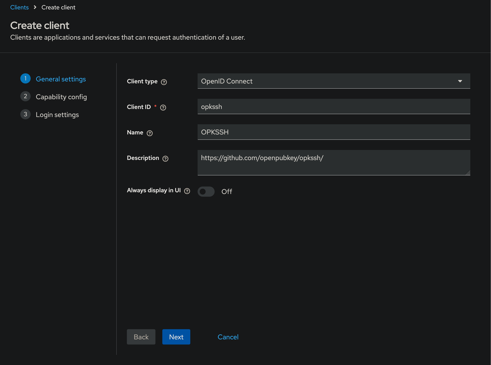
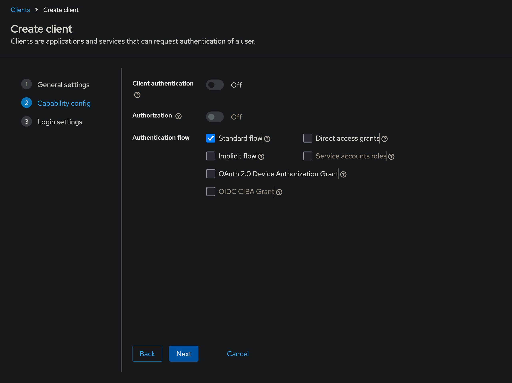
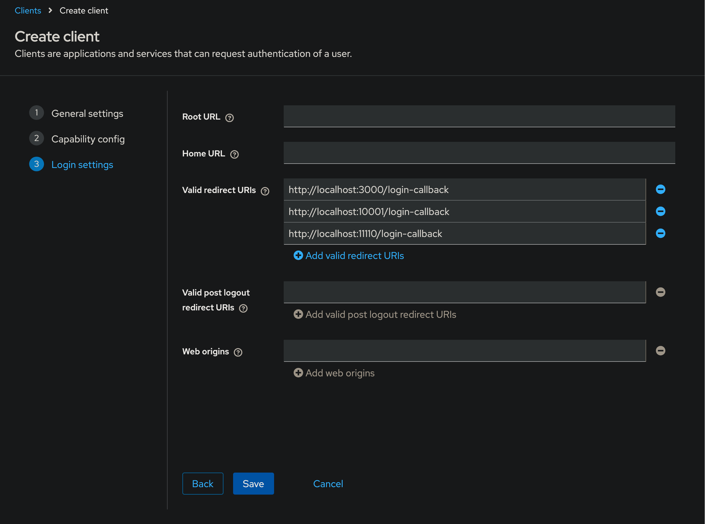
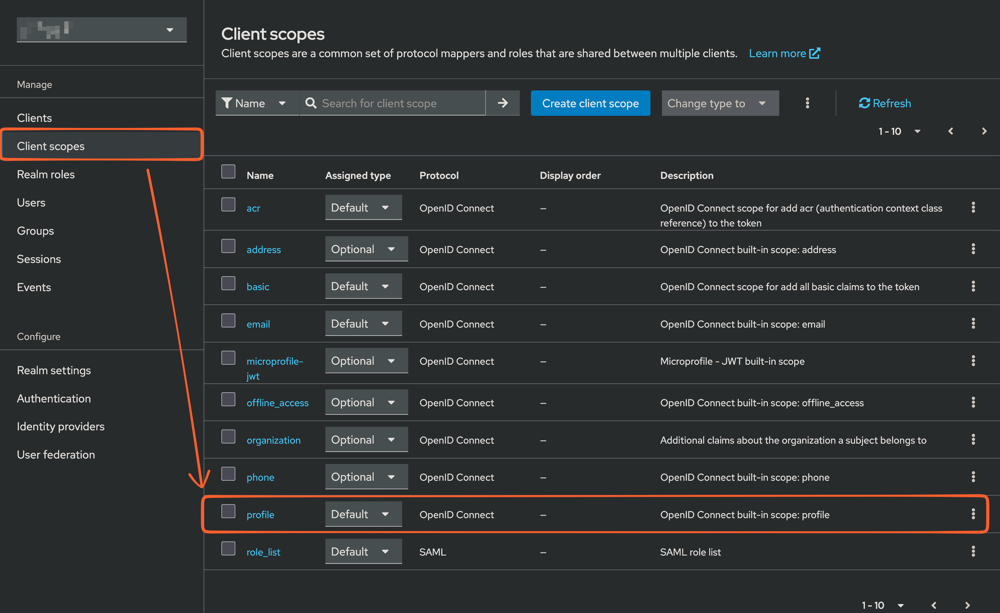
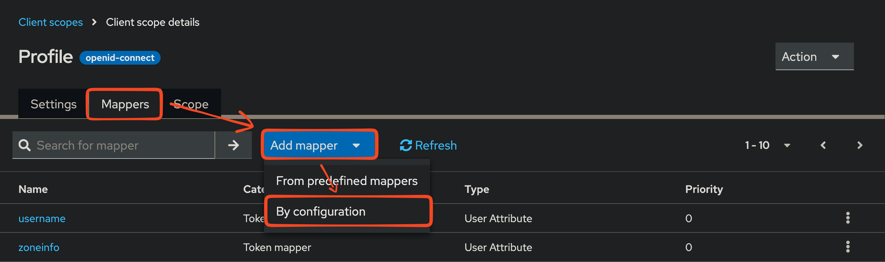
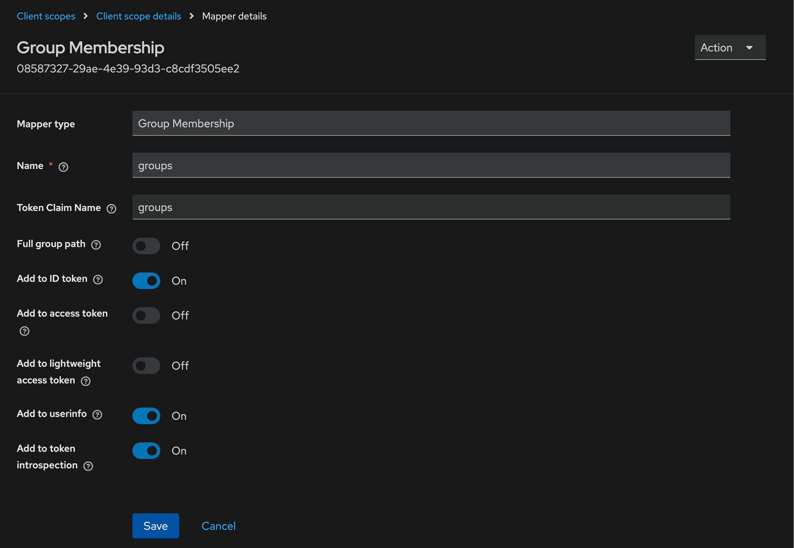
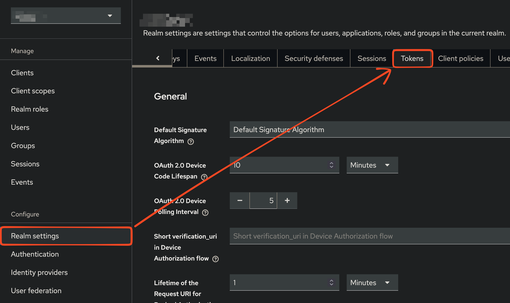
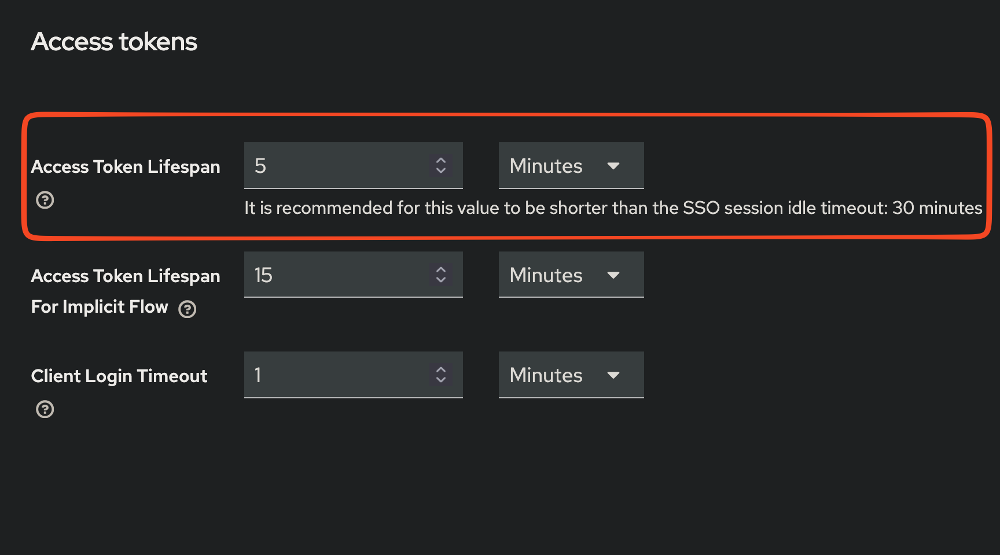

# Configuring Keycloak for OPKSSH

## Setup

### 1. Add a client for OPKSSH

Sign into your Keycloak administration console and add a new client from the "Manage" section by clicking "Create client".


This should take you to this first step. Please note that the `CLIENT_ID` defined here will be used for opkssh client and server configurations. We choose to use `opkssh` for the `CLIENT_ID`.



Click "Next" and configure the authentication flow (standard flow).



Click "Next" and configure the following three redirect URIs:

```text
http://localhost:3000/login-callback
http://localhost:10001/login-callback
http://localhost:11110/login-callback
```



### 2. Optional: add groups to the profile information

Include groups in their profile information if you want to allow them to connect to servers based on group membership rather than only their identity.

In the "Manage" section, click "Client Scopes" then the "profile" scope.
> [!WARNING]
>
> You may want to create a dedicated scope if you don't want groups to be exposed to other clients.



Click the "Mappers" tab, then "Add mapper" > "By configuration".



Configure the groups mapper (here we use `groups` as the key in the token). Make sure it is included in ID tokens.



### 3. Update provider configuration on servers and clients

For each server where you have installed opkssh, edit the file `/etc/opk/providers` and set the provider entry to point to your Keycloak realm and to use the `CLIENT_ID` you registered.

```text
# Issuer Client-ID expiration-policy 
https://your-keycloak-instance.tld/realms/your-realm {CLIENT_ID} 24h
```

To test, run `opkssh login --provider="https://your-keycloak-instance.tld/realms/your-realm,CLIENT_ID"` with the `CLIENT_ID` you registered (`opkssh` in this guide).
If this works, the server has been set up correctly.

On the client, check whether you have already created a config at `~/.opk/config.yml`. If no config is found, create one by running `opkssh login --create-config`.

Then edit `~/.opk/config.yml` and change (or add) the `keycloak` provider entry to use the `issuer` (realm URL) and `CLIENT_ID` values from the client you registered in Keycloak.

```yaml
  - alias: keycloak
    issuer: https://your-keycloak-instance.tld/realms/your-realm
    client_id: {CLIENT_ID}
    scopes: openid email profile
    access_type: offline
    prompt: consent
    redirect_uris:
      - http://localhost:3000/login-callback
      - http://localhost:10001/login-callback
      - http://localhost:11110/login-callback
```

For more information see: [opkssh configuration files](https://github.com/openpubkey/opkssh/blob/main/docs/config.md).

### 4. Test

Then run `opkssh login` or `opkssh login keycloak` on the client.
It should run without error.

## Troubleshooting (Common Issues)

### Error message: failed to exchange token: token has expired

It may be the case that your Keycloak instance and your machine clocks are out of sync. By default, Keycloak issues ID tokens that are only valid for a short period of time.

If you cannot get them in sync, you can extend token lifetimes. In the "Configure" section, click "Realm settings" then the "Tokens" tab.



Increase the "Access Token Lifespan" as necessary.


